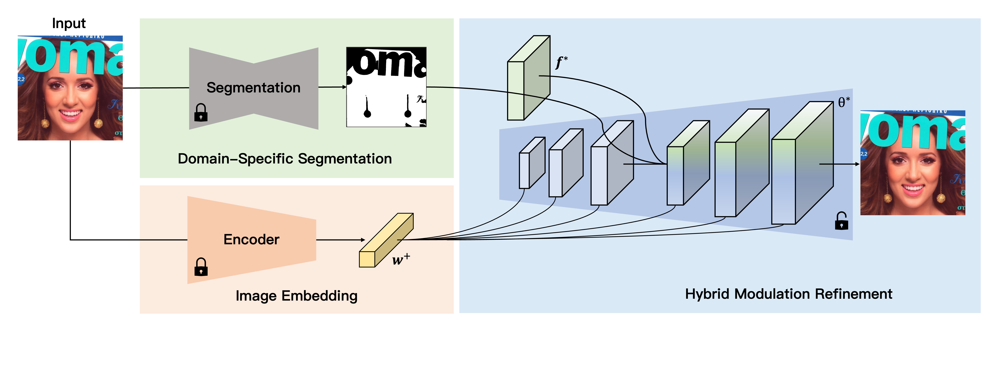

# Domain-Specific Hybrid Refinement (DHR) [Arxiv2023]

> [What Decreases Editing Capability? Domain-Specific Hybrid Refinement for Improved GAN Inversion](https://arxiv.org/abs/2301.12141)

## Abstract

Recently, inversion methods have focused on additional high-rate information in the generator (e.g., weights or intermediate features) to refine inversion and editing results from embedded latent codes. Although these techniques gain reasonable improvement in reconstruction, they decrease editing capability, especially on complex images (e.g., containing occlusions, detailed backgrounds, and artifacts). A vital crux is refining inversion results, avoiding editing capability degradation. To tackle this problem, we introduce \textbf{D}omain-Specific \textbf{H}ybrid \textbf{R}efinement (DHR), which draws on the advantages and disadvantages of two mainstream refinement techniques to maintain editing ability with fidelity improvement. Specifically, we first propose Domain-Specific Segmentation to segment images into two parts: in-domain and out-of-domain parts. The refinement process aims to maintain the editability for in-domain areas and improve two domains' fidelity. We refine these two parts by weight modulation and feature modulation, which we call Hybrid Modulation Refinement. Our proposed method is compatible with all latent code embedding methods. Extension experiments demonstrate that our approach achieves state-of-the-art in real image inversion and editing.



## Results

TODO

## Inference

```bash
python scripts/infer.py \
	--config configs/e4e/new.yaml configs/dhr/dhr.yaml \
	--test_dataset_path /path/to/test/data \
    --output_dir /path/to/output/dir \
    --checkpoint_path /path/to/e4e/weight
```

- `--save_intermidiated`: If true, DHR will save intermediated information like segmentation, modulated feature, and modulated weight. 

## Citation

```latex
@article{cao2023decreases,
  title={What Decreases Editing Capability? Domain-Specific Hybrid Refinement for Improved GAN Inversion},
  author={Cao, Pu and Yang, Lu and Liu, Dongxu and Liu, Zhiwei and Li, Shan and Song, Qing},
  journal={arXiv preprint arXiv:2301.12141},
  year={2023}
}
```

